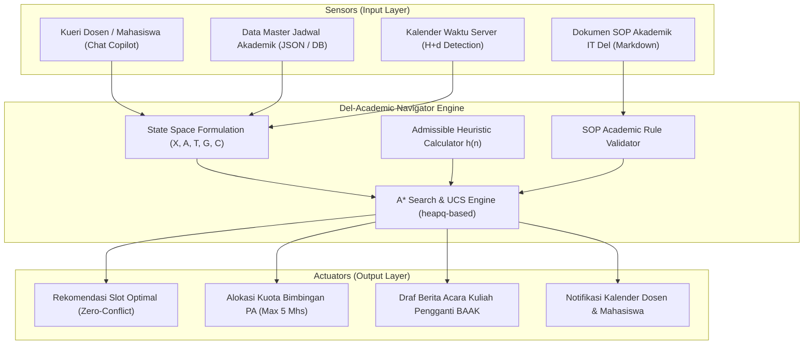

# Del-Academic Navigator
### Enterprise AI Copilot untuk Layanan Bimbingan Akademik dan Penjadwalan Ulang Kuliah Kampus Institut Teknologi Del

[](https://www.python.org/)
[](https://github.com/astral-sh/uv)
[](https://pytest.org)
[](LICENSE)
[](https://www.del.ac.id/)

---

## 1. Latar Belakang & Gambaran Umum

**Institut Teknologi Del (IT Del)** merupakan institusi pendidikan tinggi berbasis asrama (*boarding campus*) dengan nilai luhur **"MarTuhan, Marroha, Marbisuk"**. Lingkungan akademik IT Del memiliki jadwal operasional harian yang sangat terstruktur:
- **08:00 - 17:00**: Perkuliahan formal, responsi, dan praktikum laboratorium di Gedung 5 (GD5), Gedung 7 (GD7), dan Gedung 9 (GD9).
- **12:00 - 13:00**: Waktu istirahat wajib makan siang.
- **19:30 - 22:00**: Waktu belajar mandiri wajib asrama (*study time*).

### Masalah Operasional (*Pain Points*)
1. **Disrupsi Jadwal & Perkuliahan Pengganti (*Make-Up Class*):** Ketika dosen berhalangan hadir karena tugas riset atau kondisi darurat, pencarian waktu pengganti secara manual menimbulkan friksi jadwal yang tinggi bagi mahasiswa angkatan paralel.
2. **Kesesuaian Kapasitas Ruangan:** Kelas paralel besar (misal gabungan 31SI1 & 31SI2 dengan total 65 mahasiswa) sering menghadapi kendala alokasi di ruangan reguler (GD512 kapasitas 40), sehingga wajib dialokasikan ke ruangan berkapasitas besar (GD721/GD722).
3. **Kepatuhan Terhadap SOP H-2:** SOP Akademik IT Del mewajibkan pengajuan jadwal pengganti minimal **H-2** agar tidak mendadak dan tidak berbentrok dengan kegiatan asrama.
4. **Antrean Bimbingan Akademik (Dosen PA):** Kuota konsultasi dibatasi maksimal **5 mahasiswa per sesi** agar evaluasi KRS dan pemantauan indeks prestasi berjalan optimal.

**Del-Academic Navigator** hadir sebagai solusi *Enterprise AI Copilot* yang mengombinasikan **State-Space Search (A\* & UCS)** untuk optimasi rute jadwal berbiaya penalti minimum dengan antarmuka cerdas berbasis SOP akademik.

---

## 2. Diagram Arsitektur Sistem



---

## 3. Spesifikasi Formal PEAS

| Komponen PEAS | Rincian Terukur & Spesifikasi |
|---|---|
| **Performance Measure** | • **Zero Conflict Rate (100%):** Tanpa bentrok dosen, mahasiswa, maupun ruangan.<br>• **Penalty Cost Minimization:** Nilai fungsi biaya $C$ minimal.<br>• **SOP Compliance (100%):** Mematuhi batas minimal H-2 dan alokasi GD721/GD722 untuk $>40$ mahasiswa.<br>• **Response Time:** Komputasi jalur $< 2$ detik.<br>• **Advising Quota:** Maksimal 5 mahasiswa per sesi bimbingan PA. |
| **Environment** | Kampus IT Del (Laguboti), ruang kuliah GD512, GD721, GD722, GD911, kalender akademik SIA, dan jadwal kegiatan asrama. |
| **Actuators** | Output slot alokasi perkuliahan pengganti, draf berita acara BAAK, reservasi kuota bimbingan PA, dan siaran notifikasi sistem. |
| **Sensors** | Teks kueri pengguna, feed jadwal akademik JSON, kalender ketersediaan ruangan/dosen, dokumen SOP akademik. |

### Klasifikasi Sifat Lingkungan (6 Dimensi Russell & Norvig)
1. **Fully Observable:** Ruang keadaan status seluruh ruangan dan jadwal tersimpan lengkap dalam sistem.
2. **Multi-Agent (Cooperative):** AI berkolaborasi dengan Dosen, Mahasiswa, dan BAAK untuk mencapai kesepakatan jadwal.
3. **Deterministic:** Setiap aksi pemilihan slot menghasilkan status penjadwalan yang pasti tanpa probabilitas acak.
4. **Sequential:** Keputusan pemilihan slot di satu waktu memengaruhi ketersediaan ruangan pada slot berikutnya.
5. **Static (selama pencarian) / Semi-Dynamic (makro):** Graf jadwal stabil selama waktu komputasi search engine.
6. **Discrete:** Waktu, hari, dan ruangan terbagi ke dalam unit-unit diskrit yang terdefinisi.

---

## 4. Formulasi Ruang Keadaan Formal $(X, A, T, G, C)$

- **$X$ (State Space):** Simpul ruang keadaan $s = \langle \text{id}, \text{day}, \text{hour}, \text{room}, \text{capacity}, \text{building} \rangle$.
- **$A$ (Actions):** Pemilihan transisi ke slot kandidat yang valid dan tidak berbentrok dengan jadwal eksisting:  
  $$A(s) = \{ \text{pindah\_ke}(s') \mid \text{slot } s' \text{ bebas bentrok} \}$$
- **$T$ (Transition Model):** Fungsi deterministik pemindahan status $T(s, a) = s'$.
- **$G$ (Goal Test):** Slot target memenuhi seluruh kriteria:  
  $$G(s) = \text{True} \iff \text{is\_goal}(s) \land \text{capacity}(s) \ge \text{peserta} \land \text{notice\_days}(s) \ge 2$$
- **$C$ (Path / Step Cost):** Biaya penalti ketidaknyamanan riil:  
  $$c(s, a, s') = w_{\text{day}} \cdot |\Delta \text{day}| + w_{\text{hour}} \cdot |\Delta \text{hour}| + w_{\text{room}} \cdot \mathbb{I}(\text{room}(s) \neq \text{room}(s'))$$
  dengan bobot standar: $w_{\text{day}} = 5.0$, $w_{\text{hour}} = 1.0$, $w_{\text{room}} = 2.0$.

---

## 5. Fungsi Heuristik & Pembuktian Matematis

Fungsi heuristik $h(n)$ dihitung berdasarkan batas bawah (*lower bound*) selisih jam menuju target:
$$h(n) = |\text{hour}(n) - \text{hour}(\text{goal})| \times 1.0$$

### Bukti Admissibility ($h(n) \le h^*(n)$)
Karena setiap transisi penelusuran $u \rightarrow v$ memiliki bobot langkah:
$$c(u, a, v) \ge 1.0 \times |\text{hour}(u) - \text{hour}(v)|$$
Maka untuk sembarang lintasan terpendek $n = v_0 \rightarrow v_1 \rightarrow \dots \rightarrow v_k = \text{Goal}$:
$$h^*(n) = \sum_{i=0}^{k-1} c(v_i, a_i, v_{i+1}) \ge \sum_{i=0}^{k-1} |\text{hour}(v_i) - \text{hour}(v_{i+1})| \ge |\text{hour}(n) - \text{hour}(\text{Goal})| = h(n)$$
Terbukti bahwa **$h(n) \le h^*(n)$ (Admissible)**, sehingga A\* menjamin solusi optimal.

### Bukti Consistency / Monotonicity
Berdasarkan ketaksamaan segitiga nilai mutlak:
$$|\text{hour}(n) - \text{hour}(G)| \le |\text{hour}(n) - \text{hour}(n')| + |\text{hour}(n') - \text{hour}(G)|$$
Karena $c(n, a, n') \ge |\text{hour}(n) - \text{hour}(n')|$, maka:
$$h(n) \le c(n, a, n') + h(n')$$
Terbukti bahwa **heuristik konsisten (monotonik)**, sehingga tidak diperlukan evaluasi ulang (*reopening*) pada simpul yang telah dikunjungi.

---

## 6. Struktur Direktori Proyek

```text
del-academic-navigator/
├── LICENSE                     # Lisensi perangkat lunak terbuka MIT
├── README.md                   # Dokumentasi utama proyek berstandar enterprise
├── pyproject.toml              # Konfigurasi proyek modern Astral uv & metadata
├── requirements.txt            # Dependensi paket Python standar
├── uv.lock                     # Lockfile dependensi Astral uv
├── docs/
│   ├── SOP_Akademik_ITDel.md   # Standar Operasional Prosedur Akademik IT Del
│   └── GrupXX_Tugas01_Problem_Framing_PEAS.md # Laporan komprehensif serahan Tugas 1
├── src/
│   ├── __init__.py
│   ├── main.py                 # Eksekusi skenario bisnis dan CLI benchmark
│   ├── del_academic_navigator/
│   │   └── __init__.py         # Package init & versioning
│   └── search/
│       ├── __init__.py         # Public exports search engine
│       ├── graph.py            # Model graf formal (X, A, T, G, C) & heuristik
│       └── scheduler.py        # Implementasi A* Search & Uniform Cost Search
└── tests/
    └── test_scheduler.py       # Test suite pytest (A*, UCS, admissibility, edge cases)
```

---

## 7. Instalasi & Cara Menjalankan

Proyek ini dikelola menggunakan manajer paket modern **Astral `uv`**.

### 1. Kloning Repositori
```bash
git clone https://github.com/PetraNaibaho/del-academic-navigator.git
cd del-academic-navigator
```

### 2. Sinkronisasi Lingkungan Virtual (Astral uv)
```bash
# Sinkronisasi dependensi otomatis via uv
uv sync
```

### 3. Menjalankan Simulasi Skenario Akademik
```bash
# Jalankan via uv
uv run python src/main.py

# Atau menggunakan perintah CLI yang terdaftar
uv run del-nav
```

### 4. Menjalankan Pengujian Otomatis (Testing Suite)
```bash
uv run pytest
```

---

## 8. Contoh Output Eksekusi

```text
================================================================================
       DEL-ACADEMIC NAVIGATOR: ENTERPRISE AI COPILOT KAMPUS IT DEL
 Layanan Penjadwalan Ulang Kuliah (Make-up Class) & Bimbingan Akademik Terpadu
================================================================================

[SKENARIO 1: PENJADWALAN ULANG KULIAH (MAKE-UP CLASS)]
• Mata Kuliah : 10S3001 - Kecerdasan Buatan (+P)
• Dosen Pengampu: Samuel Indra Gunawan Situmeang
• Peserta       : Kelas 31SI1 & 31SI2 (Total: 65 Mahasiswa)
• Kasus         : Terjadi bentrok jadwal darurat pada slot Selasa 10:00 (GD512).
• Regulasi SOP  : Pengajuan minimal H-2; Kelas > 40 mhs wajib di GD721/GD722.

Mencari alur jadwal terbaik dari 'Start_Slot' ke 'Jumat_08:00_GD722'...

--------------------------------------------------------------------------------
Metrik Perbandingan            | A* Search              | Uniform Cost Search (UCS)
--------------------------------------------------------------------------------
Jalur Terpilih                 | Start_Slot -> Rabu_08:00_GD512 -> Jumat_08:00_GD722 | Start_Slot -> Rabu_08:00_GD512 -> Jumat_08:00_GD722
Total Biaya Penalti (Cost)     | 20.00                  | 20.00                 
Simpul Dieksplorasi (Nodes)    | 6                      | 6                     
Waktu Komputasi                | 0.015 ms               | 0.005 ms              
--------------------------------------------------------------------------------

[ANALISIS KEPUTUSAN AI COPILOT]
[OK] Jalur Rekomendasi : Start_Slot -> Rabu_08:00_GD512 -> Jumat_08:00_GD722
[OK] Total Penalti     : 20.0 (Minimum / Solusi Optimal)
[OK] Validasi SOP Del  : Memenuhi syarat minimal H-2 (dilaksanakan Kamis/Jumat).
[OK] Validasi Fasilitas: Menggunakan GD721 (kapasitas 80) dan GD722 (kapasitas 75)
                      sehingga 65 mahasiswa tertampung dengan aman.
[OK] Efisiensi A*      : Heuristik h(n) memandu pencarian secara admissible,
                      mengeksplorasi 6 node (<= UCS: 6 node).

================================================================================
[SKENARIO 2: ALOKASI SESI BIMBINGAN AKADEMIK (DOSEN PA)]
• Layanan       : Konsultasi Persetujuan KRS & Evaluasi Indeks Prestasi
• Dosen PA      : Dosen Wali Sarjana Sistem Informasi
• Batasan SOP   : Maksimal kuota 5 mahasiswa per sesi bimbingan.
================================================================================
Jalur Slot Bimbingan Terpilih : Antrean_Mhs -> Sesi_1_Senin_09:00
Biaya Penalti Konsultasi      : 1.5
Status SOP IT Del             : Memenuhi kuota 5 mhs/sesi di Ruang Dosen 911.

================================================================================
[SKENARIO 3: RESOLUSI BENTROK JADWAL MULTI-MATA KULIAH (GOAL: CONFLICT_COUNT == 0)]
• Deskripsi Kasus : Mahasiswa kelas 31SI1 mengambil 2 matakuliah yang bentrok di slot awal.
• Mata Kuliah A   : 10S3001 - Kecerdasan Buatan (Dosen: Samuel Situmeang)
• Mata Kuliah B   : 10S3002 - Basis Data Lanjut (Dosen: Tim Pengampu BD)
• Kondisi Awal    : Keduanya terjadwal di Senin 10:00 (GD512) -> Bentrok Mahasiswa & Ruang!
================================================================================
Jumlah Konflik Awal (Initial State) : 2 bentrok
  [!] Bentrok Ruang GD512 antara 10S3001 & 10S3002 pada Senin 10:00
  [!] Bentrok Mahasiswa (31SI1) antara 10S3001 & 10S3002 pada Senin 10:00

[HASIL RESOLUSI A* SEARCH]
Jumlah Konflik Akhir (Goal State)   : 0 bentrok (Goal Test: True)
Total Biaya Penalti Perubahan (Cost): 3.00
Simpul Ruang Keadaan Dieksplorasi  : 2 node
Aksi Perubahan Jadwal:
  -> Pindahkan 10S3002 -> Senin 13:00 (GD512)
Alokasi Akhir Bebas Bentrok:
  * 10S3001: Senin 10:00 di GD512 (Kapasitas: 40)
  * 10S3002: Senin 13:00 di GD512 (Kapasitas: 40)

================================================================================
Milestone 1 Terpenuhi: State Space Search teruji bebas bug & siap untuk Milestone 2.
================================================================================
```

---

## 9. Lisensi & Hak Cipta

Proyek ini dirilis di bawah lisensi terbuka [MIT License](LICENSE).  
Hak Cipta (c) 2026 Institut Teknologi Del - Program Studi Sarjana Sistem Informasi.